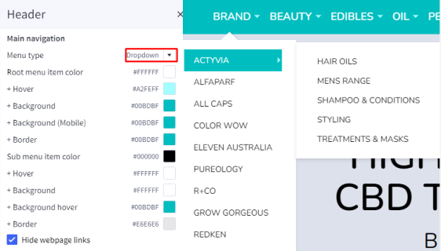
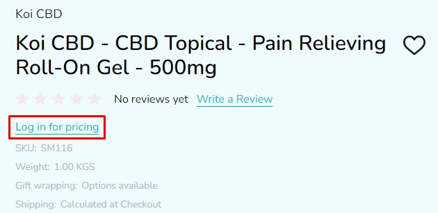
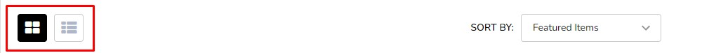
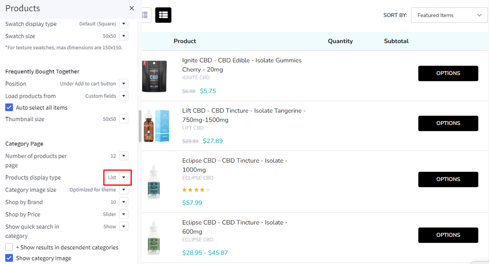

# Usage Guide

## Get Started

Thanks for using our theme!

To set up the theme exactly like our demo stores, you may need to install the our free app **[PapaThemes Widgets](https://www.bigcommerce.com/apps/papathemes-widgets/)**. This app provides additional widgets to build the content in Page Builder visually without coding skill. 

For displaying your Instagram photos on your website, you can use our free tool **[PapaThemes Instagram](https://instagram.papathemes.com/)**. We will guide you step by step later in this manual.

### Customizing Typography, Fonts and Colors

Customizing Typography, Fonts and Colors, Buttons in **Page Builder** > **Theme Styles** > **General**. There are dozens of options to help you customize your website beautifully and uniquely.

### Customizing Checkout Page's Typography and Colors

Customizing the checkout page's typography and colors in **Page Builder** > **Theme Styles** > **Optimized Checkout**

### Installing PapaThemes Widgets App

Find and install **[PapaThemes Widgets](https://www.bigcommerce.com/apps/papathemes-widgets/)** app from [BigCommerce Apps Marketplace](https://www.bigcommerce.com/apps/).

After installed, go to your admin page, on the left sidebar, click **Apps** >** My Apps**, click **Launch** button of PapaThemes Widgets app to open the app:


Then click the Install buttons in turn to install all available widgets:


Go to **Storefront** > **My Themes** > click **Customize** in dropdown menu of InHeath theme to open Page Builder. Select any theme style to start:


Verify the widgets installed successfully if they appear in Page Builder:


## Setting Up CBD Style Home Page

To start customizing the theme, login to your admin panel, go to **Storefront** > **My Themes**, click **Customize** button next to theme thumbnail.

### Header


To configure the header, click on **Theme Styles** > **Header** section, here you can config the header colors, store logo position and size.

**User Navigation** allows to change colors of icon cart, recently viewed, account and text phone number.

**Top Bar** section allows to change color of this top bar.

**Watch the instruction video:**

<div style="padding:56.25% 0 0 0;position:relative;"><iframe src="https://player.vimeo.com/video/796872043?h=5d2873e4a6&amp;badge=0&amp;autopause=0&amp;player_id=0&amp;app_id=58479" frameborder="0" allow="autoplay; fullscreen; picture-in-picture" allowfullscreen style="position:absolute;top:0;left:0;width:100%;height:100%;" title="instr-header"></iframe></div><script src="https://player.vimeo.com/api/player.js"></script>

#### Quick search

**Quick Search** allows user to change the colors of the search form.

To configure the **Quick Search**, click on **Theme Styles** > **Header**. In **Quick Search** section you can change text colors, hover, border, and background of the search field.


#### Main Navigation

**Main Navigation** allows to customize this navigation bar like changing the menu type to column, dropdown menu or mega menu; changing colors of the top menu as well as the sub-menus. There is an option "**Hide webpage links**" that allows to hide the static web page links on the main navigation.

To configure the Main navigation, click on **Theme Styles** > **Header**. In **Main navigation** section you can change:

- **Root menu item color**: text color of root menu item.

- **+ Hover**: text color on hover on the root menu item.

- **+ Background**: background color of sub menu block.

- **+ Background (Mobile)**: background color of menu on mobile device.

- **Sub menu item color**: text color of the submenu item.

- **+ Hover**: text color on hover on the submenu item.

- **+ Background**: background color of the submenu item.

- **+ Background hover**: background color on hover on the submenu item.

- **+ Border**: border-color of mega menu popup.


To config style of main navigation, click on **Theme Styles** > **Header**. In **Main navigation** select **Menu style**. The theme offer 3 option as below:

- `Mega menu`: show submenu under Mega menu style. **Mega menu** allow user insert banner and product into it


- `Dropdown`: show sub-menu item as dropdown style.



- `Column`: show sub-menu item as column style.


You can also hide or **Show web page links** and **Show widgets in the mega menu**.

**Watch the instruction video:**

<div style="padding:56.25% 0 0 0;position:relative;"><iframe src="https://player.vimeo.com/video/796851987?h=a75fba7b62&amp;badge=0&amp;autopause=0&amp;player_id=0&amp;app_id=58479" frameborder="0" allow="autoplay; fullscreen; picture-in-picture" allowfullscreen style="position:absolute;top:0;left:0;width:100%;height:100%;" title="instr-main navigation"></iframe></div><script src="https://player.vimeo.com/api/player.js"></script>

### Top Banner

The top banner can be created in **Marketing** > **Banners**, click **Create a Banner** button, enter Banner Name, Banner Content, select Show on Page = Home Page, select Location = Top of Page.

Go back to **Storefront** > **My Themes** > click **Customize** button beside the theme thumbnail. You can see the top banner appears above the header. To change the colors of the top banner, go to **Theme Styles** > **General** > **Top banners** section. Here you can change the text color and the background color.

**Watch the instruction video:**

<iframe width="560" height="315" src="https://www.youtube.com/embed/AWPZNKszf6w" title="YouTube video player" frameborder="0" allow="accelerometer; autoplay; clipboard-write; encrypted-media; gyroscope; picture-in-picture" allowfullscreen></iframe>

### Ad Banner displays on all pages

To display the ad banner appearing on all pages on the header, drag and drop the HTML widget to the corresponding position, paste the given code below to the HTML editor, then click Save HTML button.

```html
<p data-marquee>
  Free shipping over 59 Euro - Code FREESHIPPING - Next Day Delivery - SAFE &amp; SECURE ONLINE SHOPPING
</p>
```

The code allows to animate the text sliding from left to right on smaller screen.

**Watch the instruction video:**

<iframe width="560" height="315" src="https://www.youtube.com/embed/gG1WesJPkkk" title="YouTube video player" frameborder="0" allow="accelerometer; autoplay; clipboard-write; encrypted-media; gyroscope; picture-in-picture" allowfullscreen></iframe>

### Main carousel


Upload the carousel images in **Storefront** > **Home Page Carousel**.

Go back to **Page Builder**, in **Theme Styles** > **Home Page**, make sure **Carousel** > **Show carousel** is selected. You can change the carousel styles and colors here.

**Watch the instruction video:**

<div style="padding:56.25% 0 0 0;position:relative;"><iframe src="https://player.vimeo.com/video/796542010?h=3030ce28cf&amp;badge=0&amp;autopause=0&amp;player_id=0&amp;app_id=58479" frameborder="0" allow="autoplay; fullscreen; picture-in-picture" allowfullscreen style="position:absolute;top:0;left:0;width:100%;height:100%;" title="instr-home carousel"></iframe></div><script src="https://player.vimeo.com/api/player.js"></script>

### Our best sellers


To create **Our best sellers**, drag & drop **Layout** widget to the corresponding position change **Columns** = `1`, **Name** = `SHOP BY CATEGORY`.

Select the **Column 1**, set **Padding** = `0`, drag & drop **Section Heading | PapaThemes Beautify** widget into the **Layout**. Typing your text (example "Our best sellers"), set **Padding** = `60 0 10 0` and **Padding (Mobile)**= `40 0 10 0`.

Drag & drop **CALLOUT ICONS | PAPATHEMES BEAUTIFY** widget below **Section Heading | PapaThemes Beautify** widget. Delete all other **callout icons** except the first one.

In **Callout 1**, set **Padding** panel set value for **Desktop** = `45 5 0 5`, **Tablet** and **Mobile** = `20 5 20 5`, upload your image. Select **Icon size** choose `custom` change **Icon width** and **Icon height** = `145`. In **Link** typing your link you want.

Duplicate Callout 1 to quantity that you want, change icon image for each icon.

### Top Brand


To create **Top brand**, drag & drop **Layout** widget to the corresponding position change **Columns** = `1`. In **LAYOUT BACKGROUND** >  **Background** select `Color`, in **Background color** set color = `#EEEEEE`.

Select the **Column 1** set **Padding** = `0`. Drag & drop **Section Heading | PapaThemes Beautify** widget into the **Layout**. Typing your text (example "Top Brands"), set **Padding** = `60 0 10 0`, **Padding (Mobile)** = `40 0 10 0`.

Drag & drop **CALLOUT ICONS | PAPATHEMES BEAUTIFY** widget below **Section Heading | PapaThemes Beautify** widget. Delete all other **callout icons** except the first one.

In **Callout 1**, set **Padding** panel set value **Desktop** = `45 5 45 5`, **Tablet** and **Mobile**= `20 5 20 5` , upload your image. Select **Icon size** choose `custom`, change the width and height of the image as you want in **IconWidth** and **IconHeight**. Turn off **Show text**. 

Duplicate Callout 1 to quantity that you want, change icon image for each icon.

Drag & drop **text** widget. In **Text** > **font-weight** select `Semi Bold`, **font size** = `16px`, double click in text choose `icon with text Insert/edit Link` and add the link you want
### Banner


To create **Banner**, Drag & drop **Layout** widget to the corresponding position, change **Column** = `1`. Select **Column 1**, set **Padding** = `0 0 0 0`.

Drag & drop **Flex Banners | PapaThemes Beautify** widget into **Colum 1**. Delete all other banners except the first one.

Upload your image, set **Image width** = `1920px`, **Image height** = `711px`. In **Content**, hide **Heading text** if your image has text. In **General** > **Padding**, set `0` for all values. In **General**, unchecked **Display banners in container div**.

<<<<<<< Updated upstream
**Content**, hide **Heading text** if your image has text.

**General** > **Padding**, set `0` for all values.

**Settings** of **Flex Banners | PapaThemes Beautify** > **General**, unchecked **Display banners in container div** and checked **Display content overlaying banner on mobile**.

=======
>>>>>>> Stashed changes
### Featured products


You can set featured products in **Products**, click the **star** icon on the same row to set the product as featured.

Go back to **Page Builder** > **Theme Styles** > **Home Page**, make sure one of the **Sections** field has **Featured Products** selected. In **Featured products** section, you can change the **Heading**, **Number of products** to display, Number of product per row (**Columns**), changing **Display type** to `Carousel` or `Grid`, changing the **background color**, editing the link of **View all products**.

### Bestselling products


Bestselling products only display when your store has some order.

You can configure bestselling products section settings in **Page Builder** > **Theme Styles** > **Home Page**, make sure one of the **Sections** field has **Popular Products** selected. In **Best-sellers products** section, you can change the **Heading**, **Number of products** to display, Number of product per row (**Columns**), changing **Display type** to `Carousel` or `Grid`, changing the **background color**, editing the link of **View all products**.

### New products


You can configure new products section settings in **Page Builder** > **Theme Styles** > **Home Page**, make sure one of the **Sections** field has **New Products** selected. In **New products** section, you can change the **Heading**, **Number of products** to display, Number of product per row (**Columns**),changing **Display type** to `Carousel` or `Grid`, changing the **background color**, editing the link of **View all products**.


### Customers Reviews


Drag & drop **Layout** widget to the corresponding position, change **Column** = `1`.

Drag and drop **Section Heading | PapaThemes Beautify** widget into **Column 1**. Typing your text (example "What Customers Say"), set **Padding** = `60 0 30 0`, **Padding (Mobile)** = `40 0 20 0`.

Drag and drop **Callout Icons | PapaThemes Beautify** below **Section Heading | PapaThemes Beautify** widget. Delete all other **Callout Icons** except the first one.
In **Padding** panel set `20 5 20 5` for **Desktop**, set `20 5 0 5` for **Table** and **Mobile**. In **Icon** select `Custom HTML/SVG`, copy and paste the given code below to the HTML editor, then click Save HTML button.

```html
<svg id="RATING" xmlns="http://www.w3.org/2000/svg" width="113.167" height="15.959" viewBox="0 0 113.167 15.959">
  <g id="Group-7">
    <path id="star" d="M13.166,15.837,8.705,13.062,4.245,15.837a.819.819,0,0,1-.9-.026.744.744,0,0,1-.292-.818l1.4-4.753L.281,6.856A.741.741,0,0,1,.039,6.04a.786.786,0,0,1,.7-.522l5-.346L7.985.444a.805.805,0,0,1,1.44,0l2.25,4.728,5,.346a.786.786,0,0,1,.7.522.741.741,0,0,1-.242.816L12.961,10.24l1.4,4.753a.744.744,0,0,1-.292.818.818.818,0,0,1-.9.026Z" transform="translate(0)" fill-rule="evenodd" fill="rgb(0,0,0)"/>
    <path id="star-2" data-name="star" d="M13.166,15.837,8.705,13.062,4.245,15.837a.819.819,0,0,1-.9-.026.744.744,0,0,1-.292-.818l1.4-4.753L.281,6.856A.741.741,0,0,1,.039,6.04a.786.786,0,0,1,.7-.522l5-.346L7.985.444a.805.805,0,0,1,1.44,0l2.25,4.728,5,.346a.786.786,0,0,1,.7.522.741.741,0,0,1-.242.816L12.961,10.24l1.4,4.753a.744.744,0,0,1-.292.818.818.818,0,0,1-.9.026Z" transform="translate(23.939)" fill-rule="evenodd" fill="rgb(0,0,0)"/>
    <path id="star-3" data-name="star" d="M13.166,15.837,8.705,13.062,4.245,15.837a.819.819,0,0,1-.9-.026.744.744,0,0,1-.292-.818l1.4-4.753L.281,6.856A.741.741,0,0,1,.039,6.04a.786.786,0,0,1,.7-.522l5-.346L7.985.444a.805.805,0,0,1,1.44,0l2.25,4.728,5,.346a.786.786,0,0,1,.7.522.741.741,0,0,1-.242.816L12.961,10.24l1.4,4.753a.744.744,0,0,1-.292.818.818.818,0,0,1-.9.026Z" transform="translate(47.878)" fill-rule="evenodd" fill="rgb(0,0,0)"/>
    <path id="star-4" data-name="star" d="M13.166,15.837,8.705,13.062,4.245,15.837a.819.819,0,0,1-.9-.026.744.744,0,0,1-.292-.818l1.4-4.753L.281,6.856A.741.741,0,0,1,.039,6.04a.786.786,0,0,1,.7-.522l5-.346L7.985.444a.805.805,0,0,1,1.44,0l2.25,4.728,5,.346a.786.786,0,0,1,.7.522.741.741,0,0,1-.242.816L12.961,10.24l1.4,4.753a.744.744,0,0,1-.292.818.818.818,0,0,1-.9.026Z" transform="translate(71.817)" fill-rule="evenodd" fill="rgb(0,0,0)"/>
    <path id="star-5" data-name="star" d="M13.166,15.837,8.705,13.062,4.245,15.837a.819.819,0,0,1-.9-.026.744.744,0,0,1-.292-.818l1.4-4.753L.281,6.856A.741.741,0,0,1,.039,6.04a.786.786,0,0,1,.7-.522l5-.346L7.985.444a.805.805,0,0,1,1.44,0l2.25,4.728,5,.346a.786.786,0,0,1,.7.522.741.741,0,0,1-.242.816L12.961,10.24l1.4,4.753a.744.744,0,0,1-.292.818.818.818,0,0,1-.9.026Z" transform="translate(95.756)" fill-rule="evenodd" fill="rgb(0,0,0)"/>
    <path id="Subtraction_1" data-name="Subtraction 1" d="M1.73,10.774a.806.806,0,0,1-.429-.122L0,9.843V0L4.812.334a.777.777,0,0,1,.694.521.737.737,0,0,1-.242.816L1.1,5.055l1.4,4.754a.747.747,0,0,1-.291.818A.819.819,0,0,1,1.73,10.774Z" transform="translate(107.62 5.184)" fill="rgb(200,200,200)" stroke="rgb(200,200,200)"/>
  </g>
</svg>
```

 Typing your text (example "7.000 +  Verified Reviews (4.8 out of 5)").

 Drag and drop **Customer Reviews | PapaThemes Beautify** below **Callout Icons | PapaThemes Beautify** widget. Delete all other **Customer Reviews** except the first one.

 In **Title**  Typing your text(In this example, we are leaving it empty). In **Content** typing positive reviews in the input field. In **Rating** select number of stars for reviews. In **Author** typing the author's name of the reviewer. In **Style for theme** select style  you want ( in this example select `InHealth` ). Duplicate to 4 reviews and change content according to each review.


### Recent blog posts


You can add blog posts in Storefront > Blog. Click the **+** button to add a new blog post. Make sure **Blog Visibility** is `on`.

To display the recent blog posts on the home page, go to Page Builder. In **Theme Styles** > **Home Page**, make sure one of Sections has **Recent Blog** selected. Scroll down the Recent Blog section, you can configure **Heading**, **Number of posts** to display. Select **Style** = `Featured` (also you can change the style to `Default` or `Grocery`) to display like our demo store. You can change the **Background color** = `#ffffff` or any color you want.

### Newsletter


To enable newsletter form, go to **Marketing** > **Email Marketing**, make sure **Allow Newsletter Subscriptions** is checked. Optionally select **Show Newsletter Summary** and enter the summary text as you want.

Go to Page Builder, in **Theme Styles** > **Footer** > **Newsletter** section, select **Style** = `InHealth`.
Make sure **Show newsletter form** is selected. You can change the **Heading**, **background color**, **background image**, **button** and **text colors**.

### Footer


In **Page Builder** > **Theme Styles** > **Footer**, you can configure the newsletter form appearance in **Newsletter** section, configure the footer link colors in **Main Footer** section, displaying store logo, contact info, store address,... **Show pages** allows to limit number of web page links to display. **Show categories** allows to limit number of category links to display. Similarly for **Show brands** option.

**Payment Icons** allows to select which payment icons to display.

**Copyright** allows to configure the copyright text.

## Setting Up Fitness Style Home Page

### General

You can read these common instructions in **Setting Up Fitness Style Home Page** chapter:

- [Header](#header)

- [Quick Search](#quick-search)

- [Main Navigation](#main-navigation)

- [Top Banner](#top-banner)

- [Ad Banner displays on all pages](#ad-banner-displays-on-all-pages)

- [Main carousel](#main-carousel)

- [Our best sellers](#our-best-sellers)

- [Top Brand](#top-brand)

- [Banner](#banner)

- [Featured products](#featured-products)

- [Bestselling products](#bestselling-products)

- [New products](#new-products)

- [Customers Reviews](#customers-reviews)

- [Recent blog posts](#recent-blog-posts)

- [Newsletter](#newsletter)

- [Footer](#footer)


## Setting Up Music Style Home Page

### General

You can read these common instructions in **Setting Up Music Style Home Page** chapter:

- [Header](#header)

- [Quick Search](#quick-search)

- [Main Navigation](#main-navigation)

- [Top Banner](#top-banner)

- [Ad Banner displays on all pages](#ad-banner-displays-on-all-pages)

- [Main carousel](#main-carousel)

- [Our best sellers](#our-best-sellers)

- [Top Brand](#top-brand)

- [Banner](#banner)

- [Featured products](#featured-products)

- [Bestselling products](#bestselling-products)

- [New products](#new-products)

- [Customers Reviews](#customers-reviews)

- [Recent blog posts](#recent-blog-posts)

- [Newsletter](#newsletter)

- [Footer](#footer)
## Setting Up Pets Style Home Page

### General

You can read these common instructions in **Setting Up Pets Style Home Page** chapter:

- [Header](#header)

- [Quick Search](#quick-search)

- [Main Navigation](#main-navigation)

- [Top Banner](#top-banner)

- [Ad Banner displays on all pages](#ad-banner-displays-on-all-pages)

- [Main carousel](#main-carousel)

- [Our best sellers](#our-best-sellers)

- [Top Brand](#top-brand)

- [Banner](#banner)

- [Featured products](#featured-products)

- [Bestselling products](#bestselling-products)

- [New products](#new-products)

- [Customers Reviews](#customers-reviews)

- [Recent blog posts](#recent-blog-posts)

- [Newsletter](#newsletter)

- [Footer](#footer)

### Recent blog


In **Page Builder** > **Theme Styles** > **Home Page** > **Recent Blog** find **Number of posts**, select `2` to change display **Recent blog**.


## Customizing Products Display

### Product Card


Configuring product cards in **Page Builder** > **Theme Styles** > **Products** > **Product cards**.

- **Alignment**: Specifying content alignment `left` or `center`.
- **Product title color**: Specifying the product name's color.
- + **Hover**: Specifying color when hover or focus.
- **Button text color**: Specifying the button text color.
- + **Background**: Specifying the button background color.
- + **Border**: Specifying the button border color.
- **Show second image on hover**: Displaying the second image when hover the product card.
- **Show border**: toggle displaying the product card border.
- **Show swatch/rectangle options**: Allows to display with swatch/rectangle type product option on every product card. It's helpful to display different product variants like colors or sizes.
- **Swatch sizes**: Specifying the swatch color/image size.
- **Badge position**: also to configure the sale badge position to `Top Left` or `Below image`.

### Displaying product price ranges

By default product price ranges is enabled. To turn off, Go to **Page Builder** > **Theme Styles** > **Products** > uncheck **Price ranges** checkbox.

**Show retail price**: Toggle displaying the product retail prices.


### Hiding prices for non logged in customers

To turn on this feature, go to **Page Builder** > **Theme Styles** > **Products** > tick **Restrict Purchase to Login** checkbox.



### Redirecting to cart page after product added to cart

By default the cart popup is displayed, if you want to take customer to the cart page instead, go to **Page Builder** > **Theme Styles** > **Products** > tick **Redirect to cart page after add to cart** checkbox.

### Showing/Hiding Quick-View button

By default quick-view buttons appear on all product cards. To hide it, go to **Page Builder** > **Theme Styles** > **Products** > un-tick **Show Quickview** checkbox.

### Showing/Hiding the quantity box on PDP

By default the quantity box shows up, to hide it, go to **Page Builder** > **Theme Styles** > **Products** > un-tick **Show quantity selection on product pages** checkbox.

### Add to Cart without leaving page

Stay on current page when adding products to cart, go to **Page Builder** > **Theme Styles** > **Products** > tick **Add to Cart without leaving page** checkbox.


### Customizing the popup displayed after product added to cart

In **Page Builder** > **Theme Styles** > **Products** > **Popup after added to cart**:

- `Default`: Displaying the large popup.
- `Mini`: Displaying a smaller popup that has auto close.
- `Cart Preview`: Displaying the whole shopping cart popup on the right side.
- `Hide`: Not show any popup.

Cart Preview added to cart popup:


### Customizing Price Labels

You can customize sale price label, before sale price label, retail price label or regular price label in 
**Page Builder** > **Theme Styles** > **Products** > **Price Labels**


### Displaying product weight, dimensions on PDP

Go to **Page Builder** > **Theme Styles** > **Products** > **Product Page**.

- Tick **Show product weight** checkbox.
- Tick **Show product dimensions** checkbox.

### Display sale badge / in-stock badge on PDP

Go to **Page Builder** > **Theme Styles** > **Products** > **Product Page**.

- Tick **Show sale badge** checkbox.
- Tick **Show in-stock badge** checkbox.

### Displaying Image gallery 

#### Displaying product image thumbnails vertically

In **Page Builder** > **Theme Styles** > **Products** > **Product Page**, checked **Show image thumbnails vertically** to display product thumbnails vertically, otherwise it's displayed horizontally.

Checked **Show image thumbnails vertically**:


### Displaying product bulk pricing inline in table

Instead of displaying bulk pricing in a popup modal, you can display it inline by going to **Page Builder** > **Theme Styles** > **Products** > **Product Page**, tick **Show bulk price as table**.


### Displaying sticky Add to Cart button on PDP on mobile

In **Page Builder** > **Theme Styles** > **Products** > **Product Page**, tick **
Show sticky Add to Cart on mobile**.


### Displaying Delivery & Returns tab

In **Page Builder** > **Theme Styles** > **Products** > **Product Page**:

- Tick **Show Delivery & Returns tab** checkbox.
- Enter the tab title in the next **Tab title** box.

You can add specific content or global content using BC widgets:


### Numbers of products, reviews, thumbnails

In **Page Builder** > **Theme Styles** > **Products** > **Product Page**:

- **Number of Product Reviews**: Specifying number of product reviews displayed.
- **Number of Related Products**: Specifying number of related products displayed.
- **Number of Customers Also Viewed Products**: Specifying number of customer also viewed products displayed.
- **Number of visible thumbnails**: Specifying number of images displayed in the product thumbnails slider.


### Displaying Swatch Options in the dropdown select box

In **Page Builder** > **Theme Styles** > **Products** > **Swatch display type**:

- Default (Square): Displaying the regular swatches by default.
- Dropdown: Displaying swatches in the dropdown select box.
- Dropdown + Square: Displaying swatches in the dropdown select box in addition to regular swatches.


### Displaying Frequently Bought Together Products


Enabling this feature in **Page Builder** > **Theme Styles** > **Products** > **Frequently Bought Together**, Select **Position** to display it.

- **Load products from**: Specifing products to display here.
  - `Custom fields __alsobought`: Specifying the relevant products in product custom fields with name `__alsobought` and value is the relevant product ID. For example:
  
  - `Related products`: Pulling from the related products.
  - `Similar by biews`: Pulling from customer also viewed products.
- **Auto select all items**: Auto select or unselect all frequently bought together products.
- **Thumbnail size**: Specifying the thumbnail image size.
### Configuring swatch dimension

In **Page Builder** > **Theme Styles** > **Products** > **Swatch display type** > Set **Swatch size**.


### Sale badge, Condition badge and custom text badges


Displaying the sale badge in **Page Builder** > **Theme Styles** > **Products** > **Product sale badges**, tick **Show sale badges**.

- **Label**: Specifying the badge text.
- **Text color**: Specifying the badge text color.
- **Background color**: Specifying the badge background color

Displaying the condition badge in **Condition badges**, tick **Show condition badges**.

Displaying the condition badge in **Custom badges**, tick **Enable custom badge from '__badge' custom field**. Edit product, add custom field with name `__badge` and value is the badge text.

- **Text color**: Specifying the text color of the custom badge.
- **Background color**: Specifying the background color of the custom badge.

### Configuring image sizes


In **Page Builder** > **Theme Styles** > **Products** > **Image Sizes**:

- Main product images: Specifying the main product image size displayed on PDP.
- Thumbnail image: Specifying the product thumbnail size.
- Zoomed image: Specifying the zoomed image size.
- Image in gallery view: Specifying product card image size.
## Customizing Category Pages

Configuring the category pages in **Page Builder** > **Theme Styles** > **Products** > **Category Page**.


### Products Display Type

Theme supports displaying products in grid mode (2, 3, 4 or 6 products per row), in list mode or bulk order mode. In **Products display type**, select the particular display mode for default display.

- **Display type** on the right allow your customers to change product category display by themselves.



**Grid 6 columns:**


**List mode:**




### Displaying Shop by Brand

- **Shop by Brand**: Specifying number of popular brands to display.


### Displaying Price Slider

- **Shop by Price**:
  - `Slider`: Displaying the price slider.
  - `List`: Displaying price list.
  - `Hide`.


### Display contextual search

This feature allows searching products within the current category and the current selected filter.


Select **Show quick search in category** = `Show` to enable it.

- **+ Show results in descendent categories**: if selected, it also displays results in the descendent categories.

### Display subcategory image thumbnails

This feature allow displaying subcategory thumbnails before products.

Select **Show subcategory thumbnails** to enable it.


### Common Settings

- **Number of products per page**: Specifying number of products to display per page.
- **Show category image**: Displaying the category image or not.
- **Show category description on AMP page**: Displaying category description on AMP category page or not. If the category content contains images, the AMP page could be invalid. It's recommended to turn off this option.

## Customizing Brand Page & Search Page

Configuring the brand page in **Page Builder** > **Theme Styles** > **Products** > **Brand Page**.

- **Number of brands per page**: Specifying number of brands to display per page.
- **Number of products per page**: Specifying number of products to display per page.
- **Brand image in gallery view**: Specifying the brand card image size.
- **Brand image in brand page**: Specifying the large image size displayed on the brand page.

Configuring the search results page in **Page Builder** > **Theme Styles** > **Products** > **Search results**.

- **Number of products per page**: Specifying number of products to display on the search results page.

### Displaying brand quick-view introduction


In **Marketing** > **Banner**, click **Create a Banner** button. 

- Enter the brand introduction content to **Banner Content**.
- Select **Show on Page** = `For a Specific Brand` and select the corresponding brand.
- Select **Location** = `Bottom of Page`.
- Then click **Save** button to finish.

Watch the instruction video:

<div style="padding:56.25% 0 0 0;position:relative;"><iframe src="https://player.vimeo.com/video/796915050?h=fa4bc20f8c&amp;badge=0&amp;autopause=0&amp;player_id=0&amp;app_id=58479" frameborder="0" allow="autoplay; fullscreen; picture-in-picture" allowfullscreen style="position:absolute;top:0;left:0;width:100%;height:100%;" title="Instr-Brand description"></iframe></div><script src="https://player.vimeo.com/api/player.js"></script>


